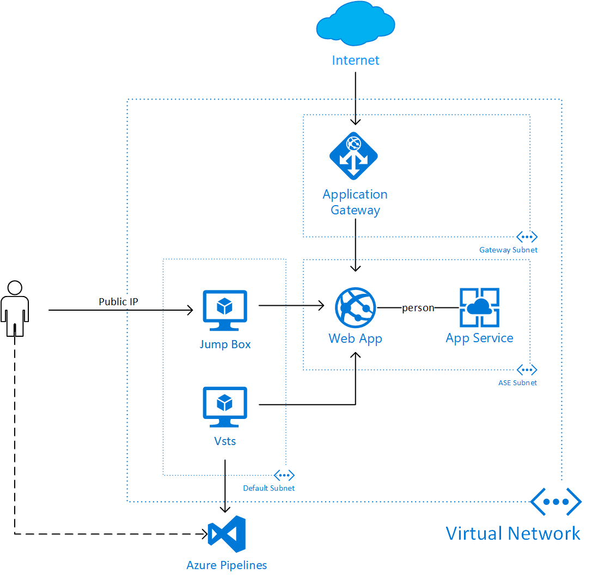

# DevOps Enabled App Service Environment

The Azure [App Service Environment (ASE)](https://docs.microsoft.com/en-us/azure/app-service/environment/intro) allows you to deploy Azure Web Apps into a private environment for enhanced security and access control. One challenge with this configuration is how to orchestrate Continuous Integration and Continuous Deployment (CI/CD) with [Azure DevOps Services](https://azure.microsoft.com/en-us/services/devops/) or [Azure DevOps Server](https://azure.microsoft.com/en-us/services/devops/server/) into such environments.

The pattern in this template deployment illustrates how to combine ASE with CI/CD using Azure DevOps. It uses the [ase](../ase) template to establish an App Service Environment with a Web App. It also uses the [ase-agent](../ase-agent) template to deploy an Azure Pipelines agent in the Virtual Network and connect this agent with an Azure DevOps instance. Finally, a jump-box is also deploy in this case to allow access to the Virtual Network for testing purposes.

The final deployment looks like this:



A number of parameters (including SSL certificate) are needed for proper deployment of this pattern. To assist with preparing these parameters, there is a [convenience script](../scripts/PrepareAseDeployment.ps1). You need an SSL certificate to support the DNS names `*.domainname` and `*.scm.domainname`, if you don't have one, the script will create a self-signed certificate for you. You can call the script with:

```powershell
scripts\PrepareAseDeployment.ps1 -DomainName mydomain-internal.us `
-TSServerUrl "https://<VSTSPROJECT>.visualstudio.com" -AdminUsername EnterpriseAdmin`
-AgentPool <NAME OF POOL> -PAToken <PA Token for VSTS/TFS> `
-OutFile C:\temp\myase-devops.parameters.json
```

The `AgentPool` and `PAToken` parameters need to be established in your VSTS or TFS instance in advance. The script will save all the parameters in a template parameter json file that you can copy/paste from or use directly with CLI or Powershell commands to deploy the template.

<a href="https://transmogrify.azurewebsites.net/ase-devops/azuredeploy.json" target="_blank">
    
</a>
